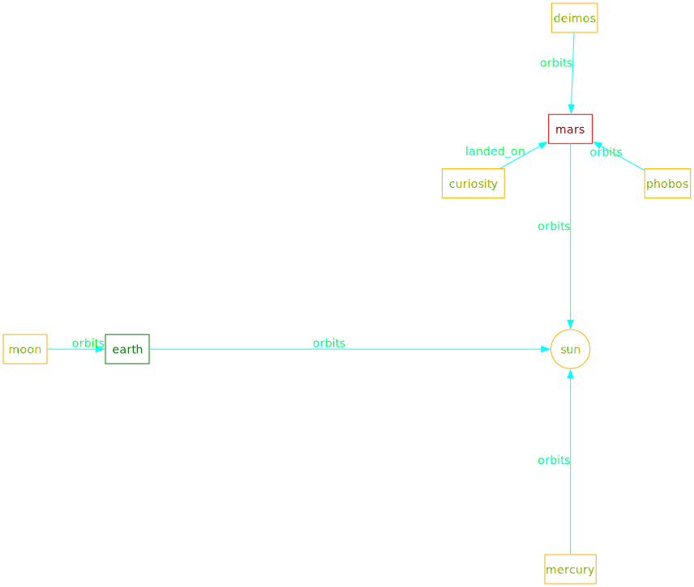

# fluxons

Python library for easy graph creation.

# Short description

Powered by python's magic `__getattr__` and `__call__`,
allows its users to express relations like:
```python
g.fran.writes.fluxons
```
that will create *on-the-fly* the nodes `fran` and `fluxons`
as members of `g` and the edge `writes` as member of `fran`
pointing to `fluxons`.

The idea is avoiding `"`, `'`, `[]` as much as possible
fusing *referencing* with *creating*.

Chain relations are possible:
```python
g.fran.writes.fluxons.in.python
```
with the expected results.

Nodes and Edges can be called as functions to store metadata
inside them:
```python
g.fran(type='human').writes(lang='python').fluxons(type='code')
```
Useful for `graphviz` later use.

**REMEMBER:** nodes are unique; edges are not.


# Caveats

* As edges are not unique (by design), they should not be referenced
as an attribute of its origin node; this will create a new edge with
the same name.
* Creating an edge *on-the-fly* without creating its destination is pointless
as its reference will be lost.
* Node and Edges names must be valid python variable names.
* Node and Edges names cannot be the same as List members.
* Node and Edges names cannot be `name`, `owner`, `md` or `dest`.

# Usage

Install `uv`.

## Run tests

* `uv run python -m unittest discover tests`

## How to combine it with `graphviz`

* `uv sync --extra gv` to install optional dependency `graphviz`.

See [solar_system.py](examples/solar_system.py) example:

* `uv run python examples/solar_system.py`
  * will create `solar_system.svg`
* If you have kitty, you can see it in the terminal:
  * `kitten icat solar_system.svg`



# TODO

* [ ] handle clusters
* [ ] handle styling
* [ ] handle ranks
* [ ] show interactive example
